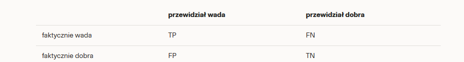
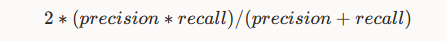
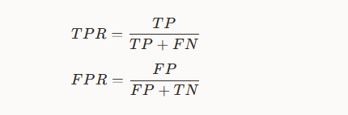
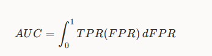
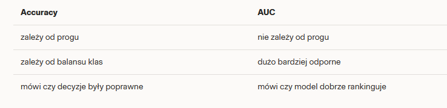
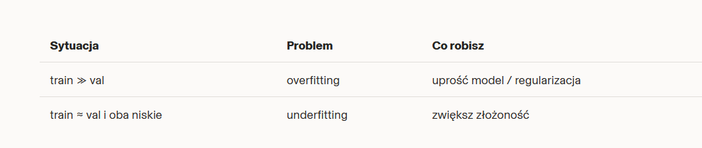

1. Macierz pomyłek (confusion matrix)

W zadaniu wykrywania wad śrub rozważamy dwie klasy: wada (positive) i dobra (negative). Macierz pomyłek ma postać 2×2 i zawiera:

- **True Positive (TP):** model przewidział "wada", i faktycznie jest wada.
- **False Positive (FP):** model przewidział "wada", a w rzeczywistości śruba jest dobra.
- **False Negative (FN):** model przewidział "dobra", a faktycznie jest wada.
- **True Negative (TN):** model przewidział "dobra", i faktycznie jest dobra.

Pozycja "positive" oznacza tutaj wadę — to klasę, którą chcemy wykryć.

Metryki oceny modelu

- **Accuracy:** odsetek poprawnych przewidywań (TP + TN) / (TP + FP + FN + TN).
- **Recall (czułość, TPR):** z wszystkich faktycznych wad, jaki odsetek został wykryty — TP / (TP + FN). Niski recall oznacza, że model dużo wad przepuszcza.
- **Precision:** z wszystkich przewidzianych jako wadliwe, jaki odsetek faktycznie jest wadą — TP / (TP + FP). Niska precyzja oznacza dużo fałszywych alarmów.
- **F1-score:** średnia harmoniczna recall i precision:

- **AUC (Area Under Curve):** mierzy, jak dobrze model separuje klasy niezależnie od progu; to prawdopodobieństwo, że losowo wybrana wada otrzyma wyższy score niż losowo wybrana dobra. AUC liczone jest na podstawie krzywej ROC, która łączy TPR (true positive rate) i FPR (false positive rate) przy różnych progach.

2. Niezrównoważone klasy (class imbalance)

Przykład: 990 dobrych i 10 wadliwych. Jeśli model zawsze przewidzi "dobra", accuracy = 99% (990/1000), ale recall = 0% (0/10) — wszystkie wady zostały przeoczone.

Sposoby radzenia sobie z nierównowagą:

- **Class weights:** przypisanie większej wagi klasie wadliwej podczas trenowania (np. ważenie strat).
- **Oversampling:** powielenie/augmentacja przykładów klasy mniejszościowej (np. z 10 do ~200 przez augmentację obrazów).
- **Undersampling:** zmniejszenie liczby przykładów klasy większościowej (ryzyko utraty informacji).

Próg (threshold)

Model często zwraca prawdopodobieństwo (score) w [0,1]. Ustawienie progu decyduje o klasyfikacji: np. przy progu 0.5 wszystko >= 0.5 oznaczamy jako "wada". Dobór progu zależy od kompromisu między recall i precision — ważna jest dobra separacja rozkładów score dla klas, a nie same wartości bezwzględne.

 